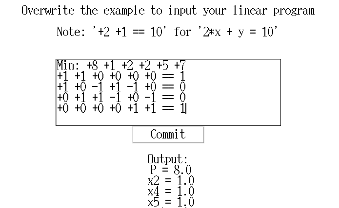

# Simplex
Python implementations of the simplex algorithm for solving linear programs in tabular form with
- `>=`, `<=`, and `=` constraints and
- each variable `x1, x2, ... >= 0`.

## Contents:
|Name | Purpose |
| ----------------- | ----------------------------------- |
| cli_simplex.py | Takes linear program inputs from command line |
| gui_simplex.py | Takes inputs using a Tkinter GUI |
| tableau.py | Core algorithm |
| examples.txt | Several examples for text input |

See [my explanation](https://gist.github.com/imengus/f9619a568f7da5bc74eaf20169a24d98) for how to convert linear programs to simplex tableaus, and the steps taken in the simplex algorithm.
